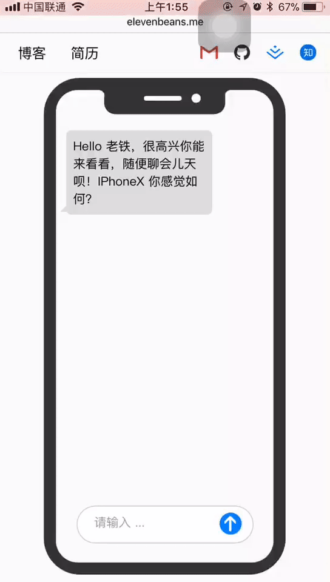

<h4 align="center">
	 
</h4>
<h1 align="center">ResumeX - by Elevenbeans</h1>

<h4 align="center">A special resume/CV or personal homepage made with React and LESS, inspired by <a href="https://github.com/Ovilia">Ovilia</a>.  Please visit: <a href="http://elevenbeans.me">http://elevenbeans.me</a>.</h4>

<h4 align="center">
	 
</h4>

## How to use

+ Star it. (All right, I'm just kidding...)

+ Clone this repository.

+ Run `npm install`.

+ Preview resumes with `npm run dev` (`export NODE_ENV=dev-HMR && npm run dev` to use [HMR](https://webpack.github.io/docs/hot-module-replacement.html)).

+ Edit your `./data/header.js` to fill your links and social information.

+ Edit your `./data/dialog.js` to complete your scripts.

+ Build with `npm run build`.

+ Publish with github pages.

Of course you can customize your resume in the `./src` directory (components and styles) if you like.

## Credits

This project uses several open source packages:

+ [React](https://github.com/facebook/react)
+ [LESS](https://github.com/less/less.js)

## License

Theme in this site by <a href="https://github.com/elevenbeans">Elevenbeans</a> is licensed under a <a rel="license" href="http://creativecommons.org/licenses/by-nc/3.0/">Creative Commons Attribution-NonCommercial 3.0 Unported License</a>, based on a work at <a href="http://github.com/ovilia/blog">https://github.com/elevenbeans/resume</a>.

你可以随意使用 `https://github.com/elevenbeans/resume` 中的源码, 因为她遵循 MIT license。当然，能给一个 Star 也是最好不过的。